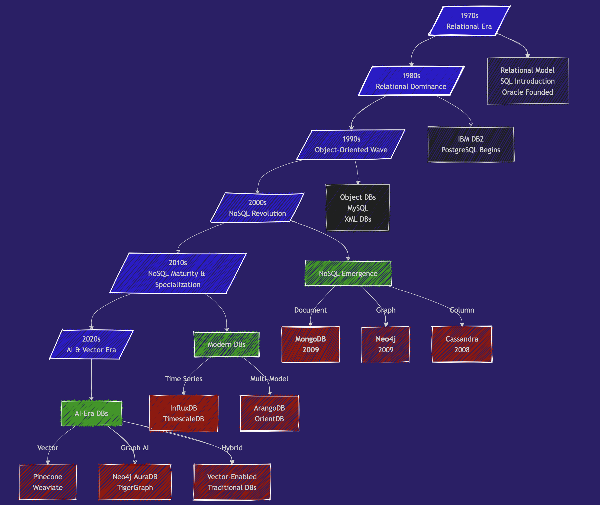
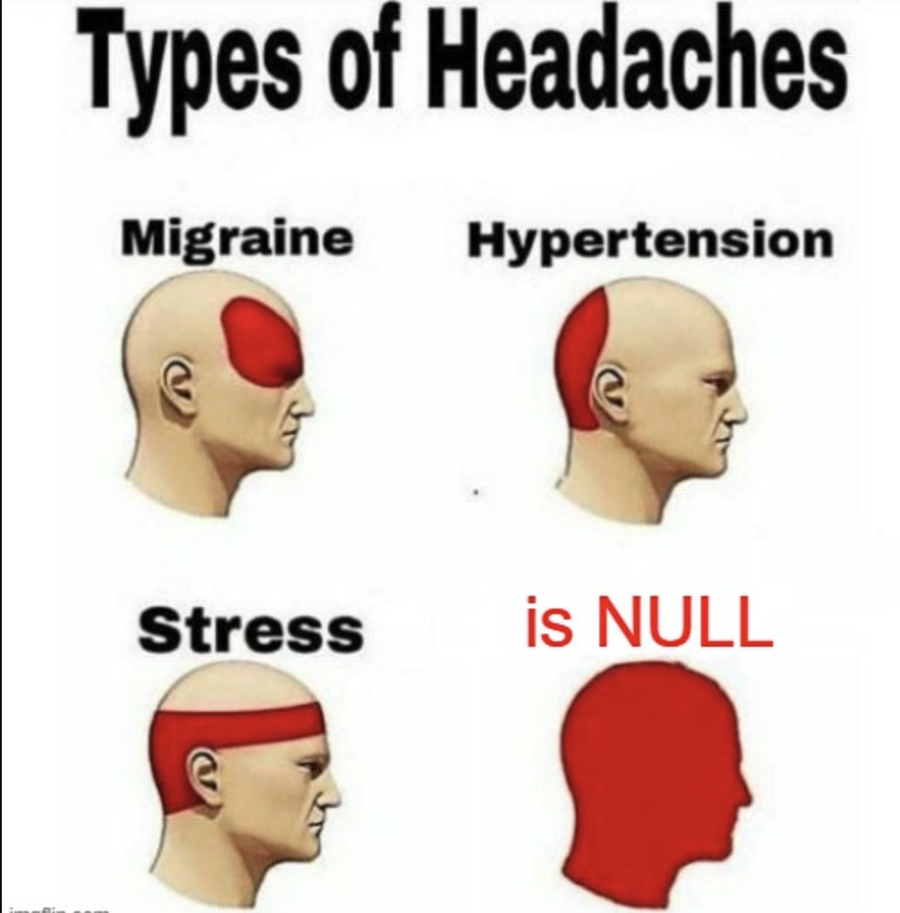

- [NoSQL and Graph Databases](#nosql-and-graph-databases)
  - [What is a database?](#what-is-a-database)
  - [What we expect from a DBMS](#what-we-expect-from-a-dbms)
  - [A Brief History of Databases](#a-brief-history-of-databases)
    - [1970s - The Beginning of the Relational Era](#1970s---the-beginning-of-the-relational-era)
    - [1980s - The Domination of Relational](#1980s---the-domination-of-relational)
    - [1990s - The Object-Oriented Wave](#1990s---the-object-oriented-wave)
    - [2000s - The Beginning of the NoSQL Revolution](#2000s---the-beginning-of-the-nosql-revolution)
      - [Why at this moment?](#why-at-this-moment)
    - [2010s - NoSQL Matures \& Specialization - Big Data and Specialized Databases](#2010s---nosql-matures--specialization---big-data-and-specialized-databases)
    - [**2020s: AI, Vector Databases, and Real-Time Needs**](#2020s-ai-vector-databases-and-real-time-needs)
    - [Current Trends (2025)](#current-trends-2025)
    - [In Brief](#in-brief)
  - [Main Categories of Databases Today](#main-categories-of-databases-today)
    - [Ecosystem](#ecosystem)
  - [SQL](#sql)
    - [Hierarchy of an SQL Database:](#hierarchy-of-an-sql-database)
  - [NoSQL](#nosql)
    - [Comparison of Replication and Partitioning](#comparison-of-replication-and-partitioning)
  - [Terminology](#terminology)
    - [MongoDB Hierarchy - NoSQL Database - MongoDB](#mongodb-hierarchy---nosql-database---mongodb)
  - [Schema-less - dynamic schema](#schema-less---dynamic-schema)
    - [Yuka and Food Products](#yuka-and-food-products)
      - [Nutriscore](#nutriscore)
  - [Introduction to Schema Flexibility](#introduction-to-schema-flexibility)
    - [Data Presence and Type](#data-presence-and-type)
    - [Nested Data](#nested-data)
    - [Consequences of Schema Flexibility](#consequences-of-schema-flexibility)
  - [When to Choose NoSQL (Document Database) Rather Than SQL?](#when-to-choose-nosql-document-database-rather-than-sql)
    - [Performance](#performance)
    - [In Brief](#in-brief-1)
  - [What About Graph Databases?](#what-about-graph-databases)
    - [Relationships](#relationships)
  - [Conclusion](#conclusion)

# NoSQL and Graph Databases

This course covers two specific types of NoSQL databases

- MongoDB, a document database
- Neo4j, a graph database
- and we will also see vector stores which are important for AI and NLP


## What is a database?


Sometimes we hear the word database used to describe an Excel file.

How can we put something as simple as a CSV or Excel file on the same level as these engineering marvels that are PostgreSQL, Weaviate, MongoDB, Neo4j, Redis, MySQL, etc...

So I asked my friend GPT-4 to give me a definition of a database:

> In simple terms:
  "A database is like a smart notebook or filing system that helps you keep track of lots of information and find exactly what you need in no time."

which definitely includes CSV files, Excel files, JSON files, XML files, and many other simple file-based formats.

If we look for the definition of a database in a more classic and venerable source of knowledge, like the [Encyclopedia Britannica](https://www.britannica.com/technology/database), we get:

> database, any collection of data or information specifically organized for rapid search by computer. Databases are structured to facilitate storage, retrieval, modification, and deletion of data.

See also the Database article on [Wikipedia](https://en.wikipedia.org/wiki/Database).

Very interesting. We're no longer just talking about quickly finding information (the **search** part) but also about:

- storage
- modification
- deletion
- Administration.

This is where a simple spreadsheet file no longer meets the objective.

## What we expect from a DBMS

A database management system (DBMS) is distinguished from a simple spreadsheet by several essential functionalities.

| Feature                        | Description                                                                                                 | Excel | DBMS |
| ------------------------------ | ----------------------------------------------------------------------------------------------------------- | ----- | ---- |
| **Data Storage and Retrieval** | Stores data in an organized manner and retrieves it as needed.                                              | ✅     | ✅    |
| **Data Manipulation**          | Allows adding, modifying, or deleting data.                                                                 | ✅     | ✅    |
| **Data Querying**              | Allows asking complex questions (queries) about the data.                                                   | ✔️     | ✅    |
| **Data Organization**          | Structures data in formats such as tables, documents, or graphs to facilitate management.                   | ✅     | ✅    |
| **Data Sharing**               | Allows multiple users or applications to use the database simultaneously.                                   | ✅     | ✅    |
| **Data Security**              | Protects data against unauthorized access or corruption.                                                    | ✔️     | ✅    |
| **Concurrency Control**        | Manages multiple users modifying data at the same time without conflicts.                                   |       | ✅    |
| **Backup and Recovery**        | Ensures that data is not lost and can be restored in case of failure.                                       | ✔️     | ✅    |
| **Data Integrity**             | Ensures that data remains accurate, consistent, and reliable.                                               |       | ✅    |
| **Performance Optimization**   | Provides tools to optimize the speed and efficiency of data retrievals and updates.                         |       | ✅    |
| **Support for Transactions**   | Ensures that a group of operations (transactions) is completed entirely or not at all. <br> ACID compliance |       | ✅    |

## A Brief History of Databases




### 1970s - The Beginning of the Relational Era

- **1970**: **[Edgar Codd](https://en.wikipedia.org/wiki/Edgar_F._Codd)** publishes "[A Relational Model of Data for Large Shared Data Banks](https://github.com/SkatAI/epita-mongodb/blob/master/pdfs/codd.pdf)"
- **1974**: **IBM** develops System R, the first SQL DBMS prototype
- **1979**: **Oracle** launches the first commercial SQL implementation

### 1980s - The Domination of Relational

- **1989**: Beginning of Postgres development (now [PostgreSQL](https://www.postgresql.org/)) at UC Berkeley
  - 🎖️🎖️🎖️ the reference SQL database.
  - now can handle no-sql & vector,
  - numerous extensions (http, postgis, ...).
  - exceptional performance.
  - and OPEN SOURCE (free, efficient, and secure).

### 1990s - The Object-Oriented Wave

- **1991**: Object-Oriented databases gain attention. <br> Most OODBs from the 90s are no longer used. But they influenced the evolution of both SQL and NoSQL databases.

- **1995**: MySQL is released as open source

### 2000s - The Beginning of the NoSQL Revolution

- 2 important papers that laid the foundations for NoSQL systems: [BigTable paper](https://research.google.com/archive/bigtable-osdi06.pdf) (Google, 2004) and [Dynamo paper](https://www.amazon.science/publications/dynamo-amazons-highly-available-key-value-store) (Amazon, 2007)

And in **2009**, 2 new databases are launched:

- 🥭🥭🥭 MongoDB
- 🎉🎉🎉 Neo4j

Tadaaah!


#### Why at this moment?

The rise of the world wide web (myspace - 2003 😍, youtube - 2005) and the massive increase in application scale by several orders of magnitude.

Suddenly, we have millions of people simultaneously trying to access and modify Terabytes of data in milliseconds.

Relational databases cannot keep up with the scale of applications, the chaotic nature of unstructured data, and the speed requirements.

The promise of NoSQL is **volume and speed**.

### 2010s - NoSQL Matures & Specialization - Big Data and Specialized Databases

- **Big Data Databases**: Systems like **Apache Hadoop** (2006) and **Apache Spark** (2009) enabled very large-scale data processing.
- **Graph Databases** gain popularity with use cases like fraud detection, knowledge graphs, and supply chain management. Neo4j and Amazon Neptune become key players.
- **Time-Series Databases (e.g., InfluxDB, TimescaleDB)**: designed for monitoring systems: IoT, logs, ...
- **Cloud Databases**: managed services like Amazon **RDS**, Google **BigQuery**, or **Snowflake**

and meanwhile, in 2013, **Docker** containers revolutionize database deployment

### **2020s: AI, Vector Databases, and Real-Time Needs**

- **Vector Databases** 🌶️🌶️🌶️ (e.g., Pinecone, Weaviate, Qdrant, Milvus, Faiss, ...):
  - Handle high-dimensional vector embeddings used in AI/ML applications

- and also:
  - 🌶️🌶️🌶️ **Graph + AI**: 🌶️🌶️🌶️ knowledge graphs and LLMs.
  - Multi-Model Databases that support multiple data models (document, graph, key-value) in a single system.
  - Real-Time Analytics: optimized for real-time data streaming and analytics.
  - Serverless Databases

### Current Trends (2025)

Vector search is booming. Vector search capabilities are being integrated into most existing DBMS, including PostgreSQL, MongoDB, and Neo4j.


### In Brief

- 1989: Launch of PostgreSQL
- 2009: Launch of MongoDB and Neo4j
- 2024: vector databases are in vogue while older databases integrate vector search

## Main Categories of Databases Today

We have many databases to choose from. It all depends on scale, application nature, budget, etc.

| Database Type             | Purpose                              | Examples                  | Application                             |
| ------------------------- | ------------------------------------ | ------------------------- | --------------------------------------- |
| **Relational - SQL**      | Fixed schema                         | PostgreSQL, MySQL, Oracle | Transactions, normalization             |
| **Document Stores**       | Flexible schema, JSON-like documents | MongoDB, CouchDB          | Web applications, content management    |
| **Graph Databases**       | Relationship-centered data           | Neo4j, ArangoDB           | Social networks, recommendation engines |
| **Key-Value Stores**      | Simple and fast lookups              | Redis, DynamoDB           | Caching, session management             |
| **Vector Databases**      | Similarity search, AI embeddings     | Pinecone, Weaviate        | AI applications, semantic search        |
| **Column-Family Stores**  | Wide-column data, high scalability   | Cassandra, HBase          | Time-series, big data applications      |
| **Time-Series Databases** | Time-ordered data                    | InfluxDB, TimescaleDB     | IoT, monitoring systems                 |


### Ecosystem

Check the ranking of all databases at <https://db-engines.com/en/ranking>

Trends: <https://db-engines.com/en/ranking_trend>


Numerous players:


source: <https://www.generativevalue.com/p/a-primer-on-databases>

Also see this interactive map that lists all players in 2023.

<https://mad.firstmark.com/>

Let's take a step back and compare an SQL relational database and a NoSQL database.

## SQL

An SQL relational database (and SQL variations):

- uses a predefined **schema**: the data structure (columns, data types, etc.) is fixed.
- relational databases are efficient for complex queries, for transactions, and for ensuring data consistency (ACID compliance).

A **relational database** can be compared to a collection of well-organized spreadsheets (tables) where each column is defined, and the tables are interconnected.

Tables have columns and rows of data. Each table has a unique key called a **primary key**.

Schema design relies on the concept of normalization/denormalization.
In a normalized database, information exists only in one table. A normalized database validates a series of rules called NF1, NF2, ...

> Important concept of **Normalization**: information exists in one and only one place.

### Hierarchy of an SQL Database:

- A unique primary key for each element in a given table
- A **foreign key** links one table to another table
- A **row** contains the value of an _entity_
- A **column** is an **attribute** or property of the _entity_
- A **table** contains all entities grouped in a fixed column structure

SQL databases = rigid, controlled, consistent data, stable.

Can be complex.

## NoSQL

A **non-relational database** is a flexible file system where you can store items
- of different shapes
- without strict rules.

NoSQL databases use non-relational data models, such as:

- Key-value (e.g., Redis, DynamoDB)
- Document (e.g., MongoDB, Couchbase)
- Wide-column (e.g., Cassandra, HBase)
- Graphs (e.g., Neo4j, arangodb)

NoSQL databases encompass very different data organization systems.
A data representation based on a data graph is very different from a document-type representation like JSON where content variability is unlimited.


In all cases, we talk about **flexible schema** with unstructured or semi-structured data.
Schema flexibility allows adding new data types or changing the data structure without requiring complex migrations.


NoSQL databases are ideal for
- **high scalability**: a system's ability to handle a significant increase in workload (data, users, transactions) while maintaining optimal performance.
  - **Vertical scalability**: increasing resources of a single server (CPU, RAM, hard drive) to handle more load.
  - **Horizontal scalability**: adding additional servers to the cluster to distribute the load.
- **Replication and partitioning**: data is distributed across multiple servers or nodes (sharding for MongoDB)
  - **Replication**: Data is copied to multiple servers to ensure availability and resilience in case of server failure.
  - **Partitioning (sharding)**: Data is divided into fragments (shards) and distributed across multiple servers.

### Comparison of Replication and Partitioning

Although both SQL and NoSQL databases support replication and sharding, there are key differences in their implementation and use:

| Aspect                 | SQL Databases                                                                           | NoSQL Databases                                                                             |
| ---------------------- | --------------------------------------------------------------------------------------- | ------------------------------------------------------------------------------------------- |
| Replication            | Often synchronous or asynchronous, with possible strong consistency.                    | Often asynchronous, with _eventual consistency_.                                            |
| Sharding               | More complex to implement, requires external tools or manual configurations.            | Natively integrated in many NoSQL databases (e.g., MongoDB, Cassandra).                     |
| Flexibility            | Less flexible due to rigid schema and ACID constraints.                                 | Very flexible, suited for unstructured data and varied data models.                         |
| Horizontal scalability | Possible, but often more difficult to manage due to joins and distributed transactions. | Designed from the outset for horizontal scalability, with native distributed architectures. |


## Terminology


In a document-type NoSQL database like MongoDB

- A **collection** is a set of **documents**.
- A document is a combination of keys: values.
- Each collection has a unique key (the _id field)
- In a document, you can have nested sub-documents. For example: A person can have multiple phones, email addresses, jobs, ...

All documents in a collection are **similar in structure** but don't need to be exactly identical.

There is no concept of normalization.

### MongoDB Hierarchy - NoSQL Database - MongoDB

- A **database** contains **collections**
- A **collection** contains all **documents** ~~~ table
- A **document** is the entity that contains the data ~~~ record
- A sub-document (nested) is a document **inside** a parent document
- A **field** is an attribute or property of the document -> column

MongoDB - SQL:

- A `document` is a record
- A `Collection` is a table
- A `Field` is a column

| MongoDB           | SQL Database |
| ----------------- | ------------ |
| database          | database     |
| Collection        | Table        |
| Document          | Record/Row   |
| Field             | Column       |
| Embedded Document | Foreign Key  |
| `_id`             | Primary Key  |
| `$lookup`         | JOIN         |

An `index` remains an `index`

## Schema-less - dynamic schema

In what situations do data change so often that we would need a special type of database?

The most common example of a NoSQL application is a social network.

- user profiles
- posts contain all sorts of content
- timeline, followers, etc.

### Yuka and Food Products

Let's take the example of a startup like [Yuka](https://yuka.io/en/)


In their own words: _Yuka deciphers product labels and analyzes the health impact of food and cosmetic products._

Its underlying database is the [open food facts database](https://world.openfoodfacts.org/), a food product database made by everyone, for everyone, with more than 3.5 million food products.

Look, for example, at the information for [Nutella](https://uk.openfoodfacts.org/product/3017620422003/nutella) and that for... [Baguette](https://world.openfoodfacts.org/product/3250393046940/baguette-constance-cereales-250g-la-campaniere)

Also see this article exploring the dataset with python pandas: <https://medium.com/@achrafelkhanjari99/a-deep-dive-into-the-open-food-facts-dataset-56259b162ac5> (available as pdf in the Github repo)

With so many products, the available information and associated information (Packaging, Carbon Impact) as well as the diversity of regulations (EU, US, UK, ... etc.) constantly vary.

The data is constantly updated while the history of changes and new additions must be preserved.

- new data becomes available as actors set up data collection. Think traceability, security, etc.
- new regulations require more data
- current events, social trends, and interests change rapidly (gluten-free, tuna and mercury, pesticides, ...)

So you start your database with a simple schema that includes:

- name, definition, image, description
- nutritional values
- ingredients

But the schema becomes increasingly complex as the data, products, and company services evolve.

#### Nutriscore

Take for example, the Nutriscore label:


The [Nutriscore](https://nutriscore.blog/2022/08/04/report-of-the-european-scientific-committee-in-charge-of-updating-the-nutri-score-changes-to-the-algorithm-for-solid-foods/) has recently evolved with a stricter new version. So you need the new Nutriscore labels while keeping the old one because not all products implement the new Nutriscore. Some companies have even completely abandoned labeling.

You started with a Nutriscore table in an SQL database:

```sql
product_id: key
nutriscore_label : array[A,B, .., E]
```

so your Nutriscore table requires a new column:

```sql
product_id: key
nutriscore_label: array[A,B, .., E]
nutriscore_new_label: array[A,B, .., E]
```

However, most products don't yet have a new Nutriscore label.

And you end up with a lot of null values in this `nutriscore_new_label` column, and null values should be avoided 👹👹👹.



You can also normalize the table and introduce a Nutriscore version column to help with Null values.

```sql
product_id: key
nutriscore_label: array[A,B, .., E]
nutriscore_version: Int
```

In both cases, you have to change all your SQL queries in your codebase.

Pain, worries, migraines, bugs, and additional costs ＄＄＄.

## Introduction to Schema Flexibility

**Schema Flexibility** in MongoDB and other NoSQL databases refers to the ability to store data without requiring a predefined schema. This means that documents in the same collection can have different fields/attributes, structures, and data types.

Schema Flexibility helps manage **unknown unknowns** in a rapidly changing world.

### Data Presence and Type

In MongoDB: You can simply add a new Nutriscore element to food products:

No Nutriscore

```json
{
  "product_id": 198273,
  "name": "Chocapic",
}
```

Nutriscore is added, just add a field to the product document

```json
{
  "product_id": 198273,
  "name": "Chocapic",
  "Nutriscore": "C"
}
```

A new version of Nutriscore arrives, just add the Nutriscore label as a dictionary with versions as keys:

```json
{
  "product_id": 198273,
  "name": "Chocapic",
  "Nutriscore": {
    "v1": C,
    "v2": D,
  }
}
```

Several representations can therefore **coexist** in the same database:

- No Nutriscore
- A single Nutriscore as a _string_
- A Nutriscore dictionary as a nested/embedded document

### Nested Data

- To be efficient, an SQL database must be normalized. For complex data, we risk ending up with many tables.
- MongoDB allows **nesting** data naturally

A good example is a person's address

In the same database, we can have people who have no address, one address, or several. And these multiple addresses have different roles: primary residence, secondary, etc....

If we use a JSON format to represent these 3 cases, we naturally have

```json
// A person with no registered address
{
    "_id": "1",
    "name": "Anita Sharma",
    "age": 29,
    "email": "anita.sharma@example.com"
}

// A person with a single address as a simple dictionary
{
    "_id": "2",
    "name": "Rahul Verma",
    "age": 42,
    "email": "rahul.verma@example.com",
    "address": {
        "type": "home",
        "street": "12 MG Road",
        "locality": "Indiranagar",
        "city": "Bengaluru",
        "state": "Karnataka",
        "pincode": "560038",
        "country": "India"
    }
}

// A person with multiple addresses as a list of dictionaries
{
    "_id": "3",
    "name": "Priya Singh",
    "age": 35,
    "email": "priya.singh@example.com",
    "addresses": [
        {
            "type": "home",
            "street": "45/2 Lajpat Nagar",
            "locality": "Central Market",
            "city": "New Delhi",
            "state": "Delhi",
            "pincode": "110024",
            "country": "India"
        },
        {
            "type": "work",
            "street": "4th Floor, Tower B",
            "locality": "DLF Cyber City",
            "city": "Gurugram",
            "state": "Haryana",
            "pincode": "122002",
            "country": "India"
        }
    ]
}
```


In SQL, you would need to have an address table and a many-to-many relationship between the person table and the person table, so an intermediate table for the join.

### Consequences of Schema Flexibility

Schema flexibility impacts every stage of a database's lifecycle

- **Design**: without rules, everything becomes possible. Design choices are dictated by the application. The way data is _consumed_ dictates the structure of data in the database.
- **Development**: with a flexible schema, changes can be implemented more quickly.
- **Maintenance**: the downside is the need to manage historical data organization and types

Extra caution is necessary to avoid chaos and **data inconsistencies**. Query performance can be affected if changes in data structure lead to inefficient or inconsistent indexing.

With NoSQL databases, the cost of implementing changes in the nature of data is shifted from the database to the application level.

However, inconsistencies in the database can still occur if multiple applications interact differently with the same database.

> In short, schema flexibility should be used with caution and only when useful and justified.

## When to Choose NoSQL (Document Database) Rather Than SQL?

So when is a NoSQL document database a better choice than SQL?

- Your data naturally corresponds to a **document** structure rather than strict tables
  - You want to store related data together rather than spreading it across tables to speed up information retrieval: queries are simpler, there are fewer joins, and code simplicity.

- Rapid Iteration: Your schema needs to evolve quickly, and you prioritize development speed over strict data consistency
  - Rapidly changing applications and data requirements
  - Early-stage startups where the data model is not yet fully understood

- also: A/B testing of different features that may require different data structures

- Scalability and Performance
  - Designed for **horizontal scaling** with built-in support for **sharding** (distributing data across multiple servers).
  - Suitable for managing large-scale, high-throughput, and geographically distributed applications.

MongoDB scales out, while PostgreSQL scales up.

- Uses a flexible JSON-like document model (BSON), making it ideal for hierarchical or semi-structured data.
  - Reduces the need for complex joins, as related data can be embedded in a single document.

MongoDB excels in:

- Applications with unstructured or semi-structured data.
- High-velocity workloads requiring rapid schema changes.
- Use cases requiring horizontal scaling in distributed environments.

### Performance

In terms of performance, the comparison most often favors PostgreSQL over MongoDB.
see [MongoDB Vs PostgreSQL: A comparative study on performance aspects](https://link.springer.com/article/10.1007/s10707-020-00407-w)

And this other article, [MongoDB vs PostgreSQL: Choosing the Best Database for Your Needs](https://www.halfnine.com/blog/post/mongodb-vs-postgresql), summarizes it well:

> _MongoDB shines in scenarios requiring the development of software applications that process various types of data in a scalable manner. It is particularly suitable for projects that need to support rapid iterative development and facilitate the collaboration of many teams.

In [Postgres vs. MongoDB: a Complete Comparison in 2024](https://www.bytebase.com/blog/postgres-vs-mongodb/)

### In Brief

- Choose MongoDB if your application has a simple data model and handles a very large volume of data
- Choose PostgreSQL if your application has complex business logic that relies on transactions.

## What About Graph Databases?

SQL databases are called relational databases.

In an SQL database, the relationship between tables is explicitly defined by foreign keys between tables.

- Product -> Vegetables -> Location, Origin
- Product -> Vegetables -> Organic / not Bio
- Product -> nutrition (sugar, fat etc)
- Product -> Nutriscore labels
- Product -> ConsumeBy

And the ERD for such a database only indicates the cardinality of the relationship:

- 1 to 1
- 1 to many


When you ask an LLM to generate a diagram for a product database, it naturally adds meaningful information to the relationships between tables.


[Mermaid](https://mermaid.live) diagram

### Relationships

Graph databases like Neo4j are centered on the _meaning_ of **relationships** between entities.

**Relationships** are as important as the data itself and are explicitly stored.

These relationships have their own properties and are stored as connections.

Whereas in SQL:

- Relationships are implicit via foreign keys
- Must be reconstructed via JOINs
- Become exponentially more complex and slow when you follow multiple levels of connections

This is why Neo4j excels in questions like:

- "Find all friends of friends who like running and live in Paris"
- "What is the shortest path between person A and person B?"
- "Who are the most influential people in this network?"

Here is an example of a knowledge graph with Obsidian


## Conclusion

So SQL databases, called relational databases, are excellent for data structures that don't change often and where relationships between objects are stable.

NoSQL databases like MongoDB: excellent when data specifications evolve rapidly or are not definitive, flexible schema, large scale

Graph databases: the relationship is key. It's not just that there is a relationship but also what is the nature of that relationship.

- NoSQL - Document is about data scalability and evolution.
- Graph is about answering specific questions, discovering different types of meaning and insights in the data.

In this session, you learned:

- RDBS and the history of databases
- An overview of different types of databases
- Relational vs non-relational database
- Flexible schema in NoSQL databases
- Why and when to choose MongoDB over SQL
