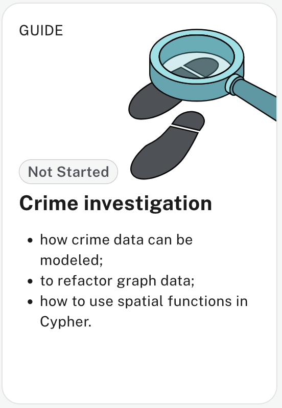

# S05.03 Workshop on the Pole dataset


The POLE dataset is a crime investigation dataset available in Neo4j Aura tutorials.

POLE stands for Person, Object, Location, Event - a standard data model used in policing and investigative work, using crime data from Manchester, U.K.

The dataset contains 29,000 crimes in 15,000 locations, generating 106,000 relationships between the nodes, built from publicly available Greater Manchester street-level crime


The POLE data model focuses on four basic types of entities and the relationships between them: Persons, Objects, Locations, and Events


### Nodes

- Person nodes: People involved in crimes (suspects, victims, witnesses)
- Object nodes: Physical items related to crimes (weapons, vehicles, etc.)
- Location nodes: Geographic places where crimes occur
- Event nodes: The actual crime incidents

### Relationships
The model employs relationships like "lives-with" and "party-to" to find deep and complex networks of connections, obscure family relationships, and social associations

## Clean up or recreate the instance

Important! Loading the dataset in Aura will ask us to select an instance. Since we're on the free tier, we only have one instance, which is already populated with the Northwind data. Importing the new dataset will just add the new nodes and relations to the existing data.


Before importing the new data we need to remove the data from the existing instance.

```cypher
// Delete all relationships first
MATCH ()-[r]-()
DELETE r;

// Then delete all nodes
MATCH (n)
DELETE n;
```

We must also remove constraints and indexes.

Manually, we see the contraints with

```
SHOW CONSTRAINTS;
SHOW INDEXES
```

and then for each line

```
DROP CONSTRAINT constraint_name_here;
DROP INDEX index_name_here;
```


There's way to do it with one line, with the APOC module, but in Aura, it's more complicated.

APOC stands for "Awesome Procedures On Cypher" - it's a comprehensive library of procedures and functions that extends Neo4j's capabilities far beyond what's available in standard Cypher.

In the end the easiest way to start with a new dataset is simply to delete the instance and create a new one.

## Load POLE data in Aura

The dataset is available in <https://github.com/neo4j-graph-examples/pole> as a Neo4j dump and in the Aura tutorials


Go to  https://console-preview.neo4j.io/guides/sample-datasets and click on the Crime investigation card


<div style='display: left; margin-left: 30px; '>

</div>


And follow the tutorial until it asks you to Load the dataset.

Click on "import POLE"

and then click on run Import (upper right side)


# POLE Dataset Cypher Exercises


## Basic Queries (Questions 1-5)

### 1. Crime Overview

**Context** Basic statistical overview for crime reporting.
**Question:** How many total crimes are recorded in the database?

```cypher
MATCH (c:Crime)
RETURN count(c) as total_crimes;
```

### 2. Crime Types
**Context** Understanding crime distribution for resource allocation.

**Question:** What are the different types of crimes in the database and how many of each type?

```cypher
MATCH (c:Crime)
RETURN c.type as crime_type, count(c) as count
ORDER BY count DESC;
```

### 3. Location Search

**Context** Geographic analysis of street-level crime.

**Question:** Find all crimes that occurred in postcode that starts with "BL3".

```cypher
MATCH (c:Crime)-[:OCCURRED_AT]->(l:Location)
WHERE l.postcode STARTS WITH "BL3"
RETURN c.id, c.type, l.postcode, l.address
ORDER BY l.postcode;
```

### 4. Person Identification
**Context** Basic suspect/witness identification.

**Question:** Find all persons with the first name "John" in the database.

```cypher
MATCH (p:Person)
WHERE p.name STARTS WITH "John"
RETURN p.name, p.id
ORDER BY p.name;
```

## Intermediate Queries (Questions 6-12)

### 6. Person-Crime Connections
**Context** Identifying suspects/witnesses in theft cases.
**Question:** Find all persons who are connected to "Burglary" crimes and show their relationship type.

```cypher
MATCH (p:Person)-[r]-(c:Crime)
WHERE c.type = "Burglary"
RETURN p.name, type(r) as relationship_type, c.id
ORDER BY p.name;
```

### 7. High-Crime Locations
**Context** Identifying crime hotspots for increased patrol.
**Question:** Which locations have more than 5 crimes and the list of crimes in each location?

```cypher
MATCH (l:Location)<-[:OCCURRED_AT]-(c:Crime)
WITH l, count(c) as crime_count, collect(c.type) as crime_types
WHERE crime_count > 5
RETURN l.address, crime_count,
       [type IN crime_types | type] as all_crimes
ORDER BY crime_count DESC;
```

### 7. High-Crime Locations
**Context** Identifying crime hotspots for increased patrol.
**Question:** Which locations have more than 5 crimes and what types of crimes occur there most frequently?

```cypher
MATCH (l:Location)<-[:OCCURRED_AT]-(c:Crime)
WITH l, count(c) as crime_count, collect(c.type) as crime_types
WHERE crime_count > 5

RETURN l.address, crime_count,
       [type IN crime_types | type] as all_crimes,
       head([type IN crime_types | type]) as most_common_type
ORDER BY crime_count DESC;
```

### 8. Officer Workload
**Question:** Which officers have investigated the most cases and what's their average case load?
**Context** Workload distribution and resource management.

```cypher
MATCH (o:Officer)-[:INVESTIGATED]->(c:Crime)
WITH o, count(c) as cases_handled
RETURN o.name, cases_handled,
       round(avg(cases_handled)) as avg_cases_per_officer
ORDER BY cases_handled DESC
LIMIT 10;
```

### 9. Social Networks
**Question:** Find persons who know each other (have KNOWS relationships) and are also connected to the same crime.
**Context** Identifying potential co-conspirators or witness networks.

```cypher
MATCH (p1:Person)-[:KNOWS]-(p2:Person)
MATCH (p1)-[r1]-(c:Crime)-[r2]-(p2)
RETURN p1.name, p2.name, c.id, c.type, type(r1), type(r2)
ORDER BY c.id;
```

### 10. Geographic Crime Patterns
**Question:** Find crimes that occurred within the same postcode area and group them by crime type.
**Context** Understanding local crime patterns for community policing.

```cypher
MATCH (c:Crime)-[:OCCURRED_AT]->(l:Location)
WHERE l.postcode IS NOT NULL
WITH substring(l.postcode, 0, 4) as area, c.type, count(c) as crime_count
RETURN area, c.type, crime_count
ORDER BY area, crime_count DESC;
```

### 11. Unsolved Cases
**Question:** Find all unsolved crimes (where outcome contains "investigation" or "ongoing") and their investigating officers.
**Context** Case management and investigation tracking.

```cypher
MATCH (c:Crime)<-[:INVESTIGATED]-(o:Officer)
WHERE c.outcome CONTAINS "investigation" OR c.outcome CONTAINS "ongoing"
RETURN c.id, c.type, c.outcome, o.name, c.date
ORDER BY c.date DESC;
```

### 12. Multi-Crime Locations
**Question:** Find locations where multiple different types of crimes have occurred and rank by diversity.
**Context** Identifying problematic areas requiring multi-faceted intervention.

```cypher
MATCH (l:Location)<-[:OCCURRED_AT]-(c:Crime)
WITH l, collect(DISTINCT c.type) as crime_types, count(c) as total_crimes
WHERE size(crime_types) > 1
RETURN l.address, crime_types, size(crime_types) as diversity_score, total_crimes
ORDER BY diversity_score DESC, total_crimes DESC;
```

## Advanced Queries (Questions 13-17)
*Complex patterns, path finding, advanced aggregation*

### 13. Criminal Networks
**Question:** Find chains of people who know each other (up to 3 degrees) where both ends are connected to violent crimes.
**Context** Mapping criminal networks and associations.

```cypher
MATCH (p1:Person)-[:KNOWS*1..3]-(p2:Person)
WHERE p1 <> p2
MATCH (p1)-[]-(c1:Crime), (p2)-[]-(c2:Crime)
WHERE c1.type CONTAINS "Violence" AND c2.type CONTAINS "Violence"
RETURN p1.name, p2.name,
       shortestPath((p1)-[:KNOWS*]-(p2)) as connection_path,
       c1.id as crime1, c2.id as crime2
LIMIT 20;
```

### 14. Temporal Crime Patterns
**Question:** Find persons who appear in multiple crimes across different months and analyze their pattern.
**Context** Identifying repeat offenders or frequent witnesses.

```cypher
MATCH (p:Person)-[r]-(c:Crime)
WITH p, c, substring(c.date, 0, 7) as month
WITH p, collect(DISTINCT month) as months,
     collect({crime: c.id, type: c.type, month: month}) as crimes
WHERE size(months) > 1
RETURN p.name, months, size(months) as active_months,
       [crime IN crimes | crime.type] as crime_types,
       crimes
ORDER BY size(months) DESC;
```

### 15. Collaborative Investigations
**Question:** Find cases where multiple officers worked together and identify the most common officer partnerships.
**Context** Understanding investigation team dynamics and partnerships.

```cypher
MATCH (o1:Officer)-[:INVESTIGATED]->(c:Crime)<-[:INVESTIGATED]-(o2:Officer)
WHERE o1 <> o2
WITH o1, o2, collect(c.id) as shared_cases, count(c) as collaborations
WHERE collaborations > 1
RETURN o1.name, o2.name, collaborations, shared_cases
ORDER BY collaborations DESC;
```

### 16. Location Risk Assessment
**Question:** For each location, calculate a "risk score" based on crime severity and frequency, then find the top 10 highest risk locations.
**Context** Prioritizing locations for increased security measures.

```cypher
MATCH (l:Location)<-[:OCCURRED_AT]-(c:Crime)
WITH l, c,
     CASE c.type
         WHEN "Violence and sexual offences" THEN 5
         WHEN "Criminal damage and arson" THEN 4
         WHEN "Burglary" THEN 4
         WHEN "Anti-social behaviour" THEN 2
         WHEN "Public order" THEN 3
         ELSE 2
     END as severity_weight
WITH l, count(c) as crime_count, sum(severity_weight) as risk_score,
     collect(c.type) as crime_types
RETURN l.address, l.postcode, crime_count, risk_score,
       round(risk_score * 1.0 / crime_count, 2) as avg_severity,
       crime_types
ORDER BY risk_score DESC
LIMIT 10;
```

### 17. Cross-Reference Analysis
**Question:** Find persons who appear as both witnesses and suspects in different cases, and identify potential reliability issues.
**Context** Assessing witness credibility and identifying pattern behaviors.

```cypher
MATCH (p:Person)-[:WITNESS_TO]-(c1:Crime)
MATCH (p)-[:SUSPECT_IN]-(c2:Crime)
WHERE c1 <> c2
WITH p,
     collect(DISTINCT c1.id) as witnessed_crimes,
     collect(DISTINCT c2.id) as suspected_crimes
RETURN p.name,
       size(witnessed_crimes) as witness_count,
       size(suspected_crimes) as suspect_count,
       witnessed_crimes, suspected_crimes
ORDER BY witness_count DESC, suspect_count DESC;
```

## Expert Level Queries (Questions 18-20)
*Complex analytics, graph algorithms concepts, optimization*

### 18. Crime Sequence Analysis
**Question:** Identify potential crime sprees by finding persons connected to multiple crimes within a 7-day window in the same general area.
**Context** Detecting serial criminal activity patterns.

```cypher
MATCH (p:Person)-[r]-(c1:Crime)-[:OCCURRED_AT]->(l1:Location)
MATCH (p)-[r2]-(c2:Crime)-[:OCCURRED_AT]->(l2:Location)
WHERE c1 <> c2
  AND abs(duration.between(date(c1.date), date(c2.date)).days) <= 7
  AND substring(l1.postcode, 0, 4) = substring(l2.postcode, 0, 4)
WITH p, c1, c2, l1, l2,
     duration.between(date(c1.date), date(c2.date)).days as day_diff
RETURN p.name,
       c1.id as first_crime, c1.date as first_date, c1.type as first_type,
       c2.id as second_crime, c2.date as second_date, c2.type as second_type,
       day_diff,
       substring(l1.postcode, 0, 4) as area
ORDER BY p.name, first_date;
```

### 19. Influence Network Analysis
**Question:** Create a "centrality score" for persons based on their connections to other persons and crimes, identifying key individuals in the network.
**Context** Identifying key players in criminal networks for targeted investigation.

```cypher
MATCH (p:Person)
OPTIONAL MATCH (p)-[:KNOWS]-(p2:Person)
OPTIONAL MATCH (p)-[r]-(c:Crime)
WITH p, count(DISTINCT p2) as person_connections,
     count(DISTINCT c) as crime_connections,
     collect(DISTINCT type(r)) as relationship_types
WITH p, person_connections, crime_connections, relationship_types,
     (person_connections * 2 + crime_connections) as influence_score
WHERE influence_score > 0
RETURN p.name,
       person_connections,
       crime_connections,
       relationship_types,
       influence_score
ORDER BY influence_score DESC
LIMIT 15;
```

### 20. Predictive Crime Hotspot Analysis
**Question:** Based on historical data, identify location clusters and time patterns to predict where future crimes might occur.
**Context** Predictive policing and resource allocation for crime prevention.

```cypher
MATCH (l:Location)<-[:OCCURRED_AT]-(c:Crime)
WITH l, c,
     toInteger(substring(c.date, 8, 2)) as day,
     toInteger(substring(c.date, 5, 2)) as month,
     substring(l.postcode, 0, 4) as area
WITH area, month,
     count(c) as crime_count,
     collect(DISTINCT c.type) as crime_types,
     collect(DISTINCT l.address) as locations,
     round(avg(day), 1) as avg_day_of_month
WHERE crime_count >= 3
WITH area, month, crime_count, crime_types, locations, avg_day_of_month,
     CASE
         WHEN month IN [6,7,8] THEN "Summer"
         WHEN month IN [12,1,2] THEN "Winter"
         WHEN month IN [3,4,5] THEN "Spring"
         ELSE "Autumn"
     END as season
RETURN area, season, month, crime_count,
       size(locations) as location_diversity,
       crime_types,
       avg_day_of_month,
       round(crime_count * 1.0 / size(locations), 2) as concentration_ratio
ORDER BY crime_count DESC, concentration_ratio DESC;
```

---

## Exercise Instructions for Students

1. **Start with Questions 1-5** to get familiar with the POLE data model
2. **Progress through 6-12** to practice relationship patterns and aggregations
3. **Tackle 13-17** for complex investigative scenarios
4. **Challenge yourself with 18-20** for advanced analytics

### Tips:
- Examine the data structure first with `CALL db.schema.visualization()`
- Use `LIMIT 10` while developing queries to avoid large result sets
- Think like an investigator - what would be operationally useful?
- Optimize queries by placing most selective conditions first

### Extensions:
- Modify queries to include additional filters
- Create visualizations of your results
- Combine multiple queries to create comprehensive reports
- Consider how these patterns could be automated for real-time alerts
